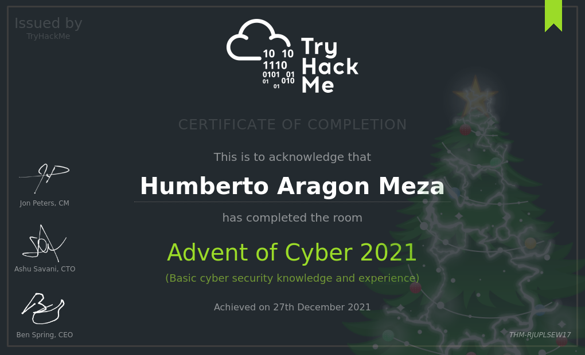
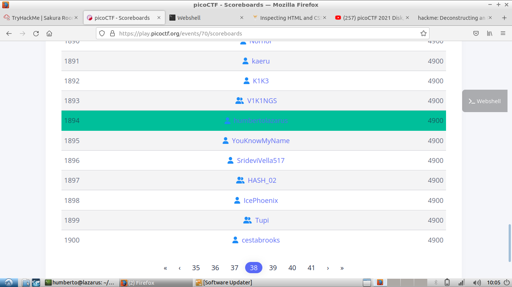
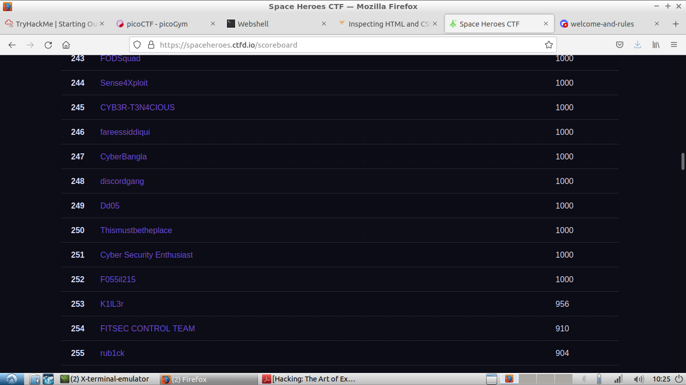

# A little bit about this directory

These are some programs that I've written to get myself to solve some challenges in some different CTFs (Capture The Flag) challenges.

I've been interested in hacking ever since I've started working with scripting languages. I've been doing challenges in _**TryHackMe.com**_ and have been active in hacking materials for around a year or so.

## Advent of Cyber

This is one of my first CTFs and the one that introduced me formally to the whole subject. I've been subscribed to the page since December 2021 and have been using the platform to get myself a JR penetration tester certificate and solving challenges.

## PicoCTF

This CTF has been hosted by Carnegie Mellon University since 2013 and it's a free competition that runs for 2 weeks and it's targeted to beginners in computer science and cyber security. Out of 7794 contestants, I ranked 1894.

## Space Heroes CTF

A space themed CTF hosted by Florida Tech, it ran for 3 days, a more challenging due to it's timeframe and that it's not aimed at begginers. Out of 778 contestants, I ranked 250. 

### **_Program descriptions_**

_1. decrypt.py_

I did this program to do a modular inverse of a sequence of numbers and then mapped the result to the ascii values of said results, giving me the answer for the challenge.

_2. diffie.py_

This one used a Diffie-Hellman key exchange algorithm that I applied to get the key to decrypt a Caesar Cypher encripted message.

_3. frequency.py_

This one I've used to analyse letter frequency in order to decrypt messages based on common letter frequency in the English Language.

